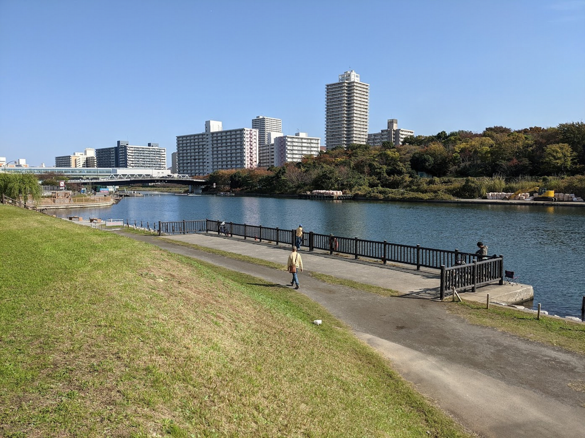
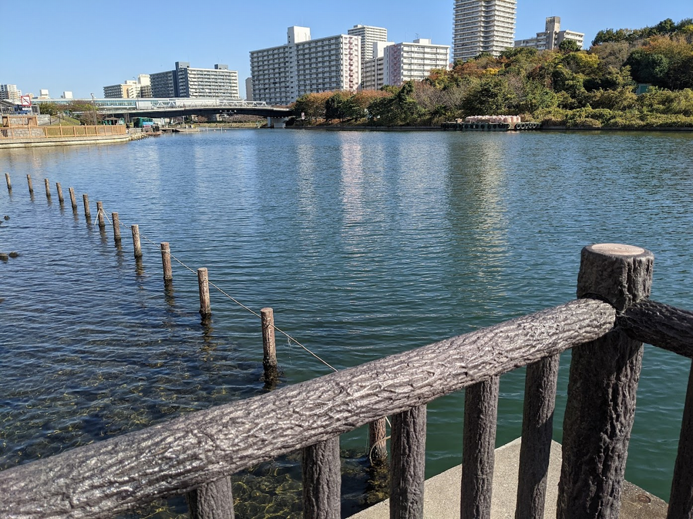
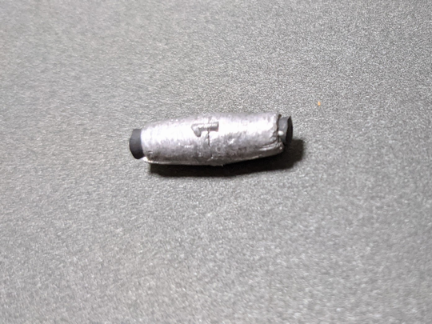
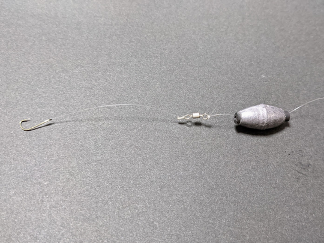
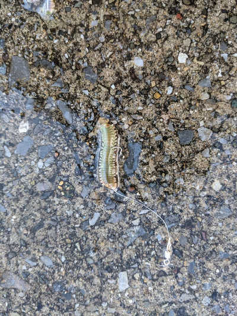

前回、夏場のデキハゼサイズを狙ったヘチ釣りを紹介しました。
秋にかけては少し投げてのミャク釣りで、10cm以上のハゼを狙うことが可能です。
投げ釣りは禁止となっているため、アンダーキャストでの釣りになりますが、
根掛かりするところも少なく、数釣りが楽しめます。
ただし、始めたころはアタリは出るが掛からない、
派手なアタリばっかりで翻弄される、
といったトラブルが続き、釣果がでない時期がありました。

釣りブログ、雑誌などを調べ、仕掛けや投げ方の修正で徐々にこれら問題を解消できました。
小松川公園でのお勧めの釣り方を紹介します。

# 釣れる時期、時間

水門の開閉で潮流が発生しますが、あまり流れがある場所ではないので、
潮の満ち引きには関係なく日中のどの時間帯でも釣れます。
日が暮れて暗くなると食いが悪くなります。
秋から冬にかけてのお勧めの時間は晴れた、無風の日の日中です。
この時期の濁りはだいぶ減り、ナギの状態だと、川底まではっきりと見えます。
夏場は濁りで見えなかった川底のゴロタ石など障害物が目視できます。
これら地形の変化のあるポイントはベイトが溜まりやすく、その付近にハゼも集まります。
晴れた無風の日に釣行し、地形の変化を目視で把握することをお勧めします。

# 釣れるポイント

小松川公園の釣り場は大きく以下の3つのポイントに分かれます。

1. 護岸の木の杭の先のきわ

   岸辺にあるゴロタ石の先の木の杭の付近。
   カケアガリとなりハゼの魚影は濃く、夏場と同様に 8 cm前後のデキハゼサイズが釣れます。
   マハゼの他に黒っぽい魚体のチチブが良く釣れます。

2. 岸から10ｍ～20ｍ付近

   木の杭から先は砂泥帯となりますが、ところどころに凸凹やゴロタ石などが点在します。
   こられ地形の変化があるポイントは、ハゼの餌となるベイトが溜まりやすく、
   ハゼが集まる好ポイントとなります。
   仕掛けをズル引きすことでこれら地形変化を確認できます。
   根掛かりするほどのきつい根ではないため、周辺に投げても問題ありません。
   ただし、木の杭の付近のゴロタ石は引っかかりやすいため、
   その付近は落とさない方が良いでしょう。
   10cm～15cmのマハゼ、ウロハゼが釣れ、どちらもから揚げにするとおいしいサイズが釣れます。

3. 岸から20mより先

    岸から20mより先に投げても余りアタリは出ません。
    砂泥帯が続き、周辺に障害物がなく、ベイトが溜まらないエリアなのかと予想します。

良型を狙うには、
2つ目の岸から10ｍ～20ｍの範囲に投げるのが適しており、
それに合った仕掛けを準備します。
以下にお勧めの仕掛けを記します。

# 釣れる仕掛け

ハゼの投げ釣りには天秤仕掛け、ミャク釣り仕掛けの２つがあります。
天秤仕掛けは飛距離がでて、良型を狙うのに適しています。
しかし、小松川公園の場合、20m の範囲に投げられれば良いので飛距離はいりません。
また、小松川公園のハゼは 10 cm前後が殆どで 15cm 以上の良型は余り釣れません。 
数釣りを楽しむには、シンプルでトラブルが少ないミャク釣りの方が適しています。
小松川公園に適したミャク釣り仕掛けを以下に記します。

1. ロッド、リール

   ルアーロッドまたは、磯竿で2ｍ～3ｍ前後の竿がお勧めです。
   コントロール重視で短めのロッドが適しています。
   20 ｍ先に投げられれば良いので、飛距離は不要です。
   リールは、2000 番前後の軽いものの方が扱いやすいかと思います。

2. 道糸

   感度の良いPEラインが適しています。
   根掛かりするようなポイントはなく、強度は不要なため、
   水切りの良い 0.8 号以下の細めの号数がお勧めです。
   好感度のPEラインを使用することでアタリがでる確立は大幅に上がります。

3. リーダー

   基本的にリーダーは不要で、PEラインにハリス止めを直結します。
   ただし、老眼で中通しオモリやハリス止めに穴を通すのが難しい場合、
   手が不器用で仕掛けのセットに時間が掛かる場合は、
   1号前後のリーダーを付けると効率よく仕掛けをセットできます。

4. オモリ

   １号、2号の中通しオモリを付けます。
   ハリス止めとの干渉を緩和するため、写真の様なゴム管付きものが良いです。

    

5. ハリス止め

   ラインとハリスの結束に、ハリス止めを使います。
   ヨリモドシにハリス止め機能がついたものを付けます。
   ハリス止めはハリスを穴に通し、針側のハリスを引っ張ればすぐ装着できるので、
   針の付け替えの効率が格段に上がります。
   ハリスは感度を上げるため短めの 4cm が良いです。
   余ったハリスはカットします。
   写真は袖針4号、ハリス止め、中通しオモリ2号、リーダーを結束したものです。

    

6. 針

   袖針４号が中心に考えます。
   狙うハゼの大きさによって、夏場の 8cm 前後のデキハゼサイズは 3号、
   秋の 10cm～15cm クラスのハゼは 4号～5号を使用します。
   色は朱色がお勧めです。
   3、4、5号の各セットを用意し、釣れるハゼのサイズに合わせて針を替えるのが良いでしょう。

   袖針のサイズですが、
   大きすぎて狙うハゼの口のサイズと合わないと極端に掛かりが悪くなります。
   小さすぎると針を飲まれやすいデメリットがありますが、
   針掛かりを優先して小さめの針を使用した方が良いと考えます。
   針を飲まれても、小さめのハゼに飲まれたらハリスを切って次の針に付け替える、
   大き目のハゼなら針はずしを使って外すといった対応が可能です。

7. 餌

   定番のアオイソメがお勧めです。
   他にも冷凍ホタテやボイルエビがありますが、アオイソメの方が食いが良いです。
   固い頭の部分はカットし、通し刺しします。
   写真のようにタラシは 1cm と短めにし、
   しっかりと針先を出すと掛かりが良くなります。

   

# 投げ方

1. ポイントに投げる

   ハゼの溜まっていそうな10m～20m付近のポイントにめがけて投げます。
   着水したら糸ふけ（ラインのたるみ）を取って、竿先を水平から少し下に落とします。
   ラインとロッドが一直線からやや上向き加減の、浅い「ヘの字」の形になるようにします。
   こうすることで、ラインを張った状態にして、アタリの感度をよくします。

2. 「居食い」のアタリまでまつ

   オモリが着底するまで待ちます。
   オモリが着底した直後にアタリが出ることが多いです。
   「ブルブル」とアタリがでたらその場で 2～3 秒待ち、
   「居食い」の小さなアタリを待ちます。
   「居食い」とは、ハゼその場でパクッと食べて動かない状態を言います。
   ひったくるような派手なアタリが続く場合は、合わせても掛かりが悪いので、アタリが落ち着くまで少し待ちます。
   「モソモソ」といった小さな「居食い」のアタリが出たら、サオを鋭く上げて合わせを入れます。

3. 合わせを入れる

   合わせは失敗しても問題はないので、何度でも合わせを入れた方が良いです。
   それらしいアタリと感じたら直ぐ合わせます。
   素早く、サオを強めに上げた方が掛かりは良いです。
   ロッドに重みがあり、「ブルブル」する反応があるようなら、リールを巻いてそのまま回収します。

１～３の操作を繰り返します。
ハゼは繰り返し落としても警戒心が強くなることはなく、何回でも食らいつきます。
また、落ちてくるものに興味を示すため、入れなおすこと自体が誘いになります。

# その他のポイント

また、仕掛けを回収したら、小まめに仕掛けの状態を確認します。

1. 藻などのゴミは、取り除くようにします。仕掛けにゴミが付着していると餌を食わなくなります。
2. 餌がずれていないか、変に曲がった状態になっていないか確認して修正します。
3. つつかれてフニャフニャになった状態は良い状態です。食いつきが良くなるので、そのままにします。
4. 数匹掛けた後は、針先がなまっていないか爪をあててみて、針がずれるか確認します。
  ずれるようなら針先がなまっているため、針を交換します。

# まとめ

* 風のない晴れた日に釣行すると川底まではっきり見える
* 岸から10m ～ 20m 先の凸凹やゴロタ石など地形の変化がある箇所が好ポイント
* シンプルでトラブルの少ないミャク釣り仕掛けが適している
* 道糸は細めの PE ラインが良い
* 針は 4号袖針を中心に、少し小さめの針を使うと良い
* ポイントに投げたらサオを少し下げ、浅い「への字」の形にして感度を上げる
* 「居食い」の「モソモソ」といった小さなアタリがでたらサオを鋭く上げて合わせる
* 投げを繰り返すことが誘いになり、食いが良くなる

