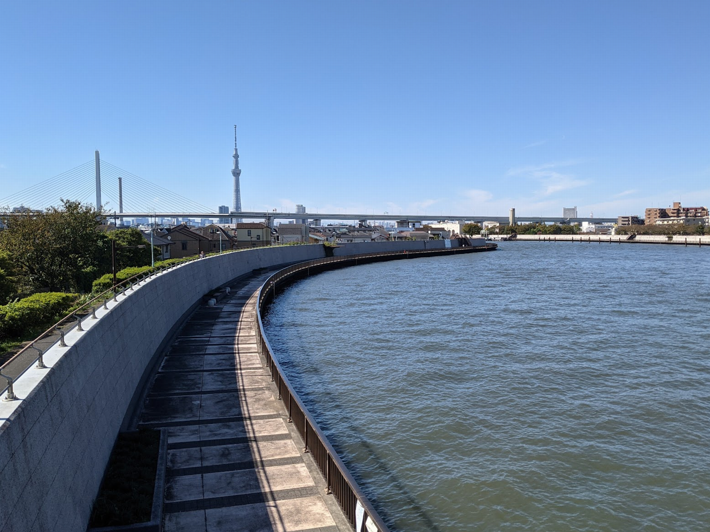
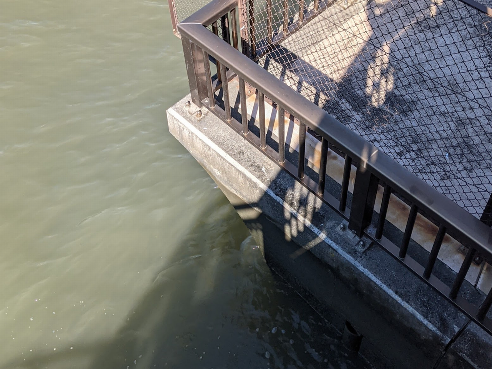
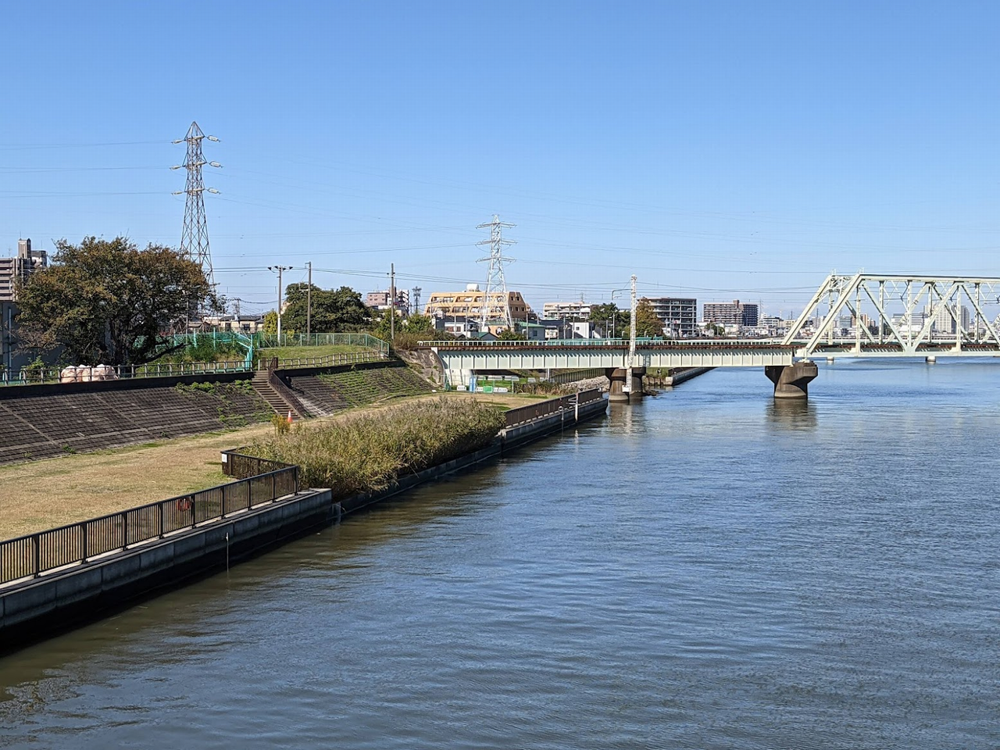
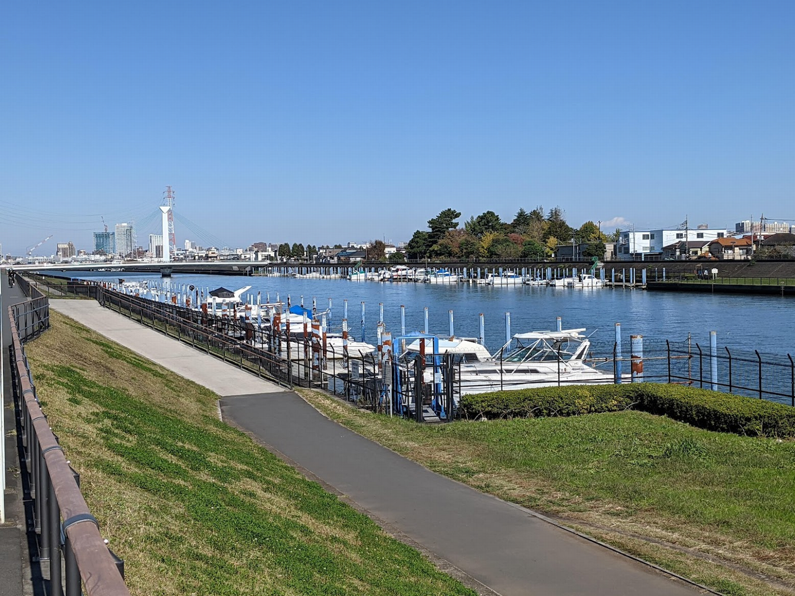
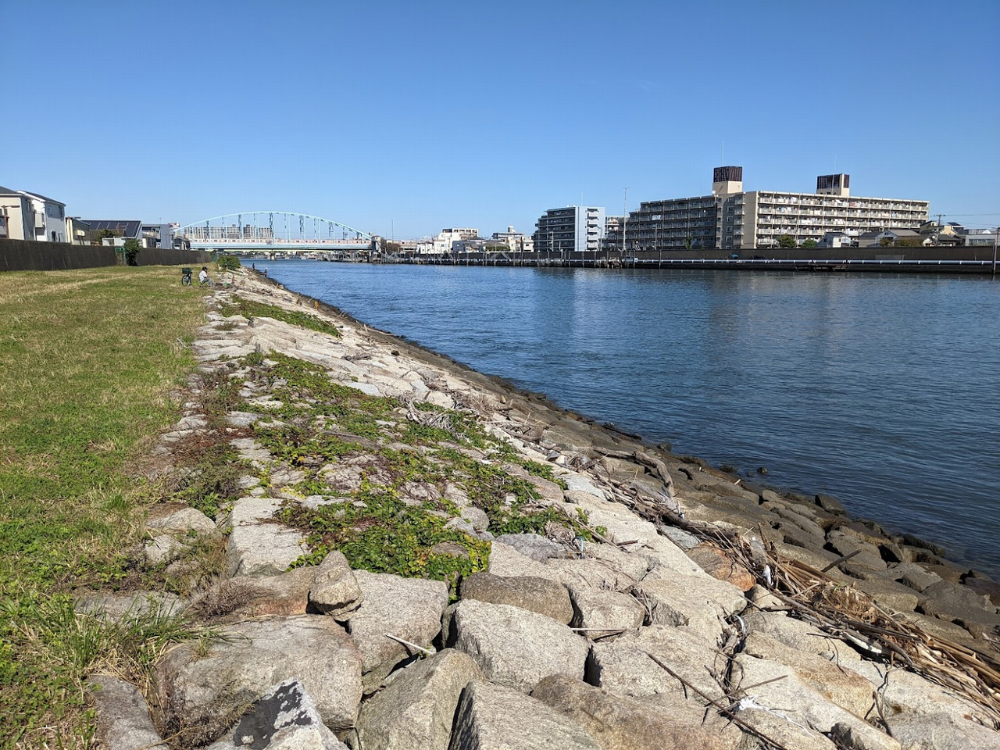
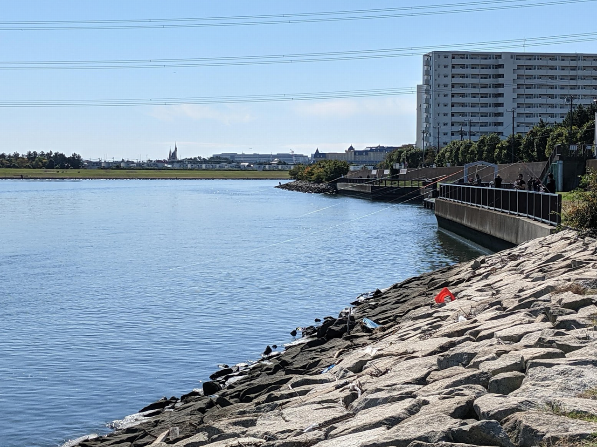

ウナギ釣りを始めた
東京の小さな河川
  身近な河川で釣れる
テクニックはあまりない
釣り場のポイントを探すのが大変
  東京は運河など開削した河川が多い、
    上流から下流まで広範囲にわたる
SNSの釣果情報のリサーチが有効
  事前に有望なポイントを見つけ
    現地調査を繰り返す
9月に 60cm 良型の 2 匹を掛けることができた
SNS釣果情報のリサーチをまとめる

- [ウナギ釣りポイント探し](#ウナギ釣りポイント探し)
  - [Anglers](#anglers)
  - [関東ウナギ釣り掲示板](#関東ウナギ釣り掲示板)
- [ウナギ釣り掲示板の釣果分析](#ウナギ釣り掲示板の釣果分析)
  - [掲示板記事をCSVに変換する](#掲示板記事をcsvに変換する)
  - [Excelに読み込ませる](#excelに読み込ませる)
  - [KH Coder に読み込ませる](#kh-coder-に読み込ませる)
  - [抽出語の分析](#抽出語の分析)
  - [「釣れる」、「釣れない」ポイントの分析](#釣れる釣れないポイントの分析)
  - [「釣れる」関連語の分析](#釣れる関連語の分析)
- [現地調査](#現地調査)
  - [中川、平和橋](#中川平和橋)
  - [新中川](#新中川)
  - [江戸川、なぎさ公園](#江戸川なぎさ公園)
- [まとめ](#まとめ)

# ウナギ釣りポイント探し

ウナギ釣りポイント探し
	SNSの釣果情報から、東京近郊の河川で広範囲にウナギが釣れている。
	東京の河川
		開削された人工河川が多い
			それぞれの河川で護岸の形状に特徴がある
	釣り場探しのポイント
		ウナギの隠れることができる障害物が多い場所
			水草
			橋脚、船着き場などの構造物
			ゴロタ石などのガレ場
	探し方
		GoogleMap で探る
			地形を把握することができる
		Anglers 釣果情報から検索
			キーワードに「東京」、「ウナギ」を入力して検索
		関東ウナギ釣り掲示板の調査
			釣果情報のSNS掲示板
				本掲示板記事の分析結果を移行でまとめる

## Anglers

[Anglers](https://anglers.jp/areas/550/fishes/59)
https://anglers.jp/areas/550/fishes/59

釣果情報SNS
日々更新、東京、ウナギで絞り込み

## 関東ウナギ釣り掲示板

[hazebbs](http://hazebbs.com/bbs3/unagi/)

  関東ウナギ釣り掲示板 記事 4つのURL
 
  * '関東ウナギ釣り': 'http://hazebbs.com/bbs3/unagi/html/log/1211857869.html',
  * '関東ウナギ釣り(その2)': 'http://hazebbs.com/bbs3/unagi/html/log/1279840340.html',
  * '関東ウナギ釣り(その3)': 'http://hazebbs.com/bbs3/test2/mread.cgi/unagi/1408241467/49-98',
  * '東京のウナギ釣り場': 'http://hazebbs.com/bbs3/test/mread.cgi/unagi/1342606169/l50',

# ウナギ釣り掲示板の釣果分析

## 掲示板記事をCSVに変換する

Python変換スクリプトを実行

## Excelに読み込ませる

月別の記事数
1000強の記事
東京ウナギ釣りのシーズンについて


時期は6月～9月

## KH Coder に読み込ませる

KHCoderに読み込ませて、抽出されたキーワードの分析

KH Coder 起動し、分析対象の CSV ファイルを設定してください。

メニュー : プロジェクト --> 新規を選択し、新規プロジェクト画面から以下を設定します。

* 分析対象ファイル : CSV ファイルを指定
* 分析対象 : content 列


メニュー : 前処理 --> 語の取捨選択を選択し、強制抽出する語に以下を追加します。

```
平和橋
```

使用しない語リストに以下を追加します。

```
ウナギ
うなぎ
```


メニュー : 前処理 --> テキストのチェックを選択します。
問題が発見されるので、テキストの自動修正を実行します。

メニュー : 前処理 --> 前処理 を実行します。

## 抽出語の分析

メニュー : ツール --> 抽出語 --> 抽出語リスト を選択します。

「釣れる」が件数ランキング1位で、リンクをクリックします。


「釣れる」の前後の文章リストが表示されます。
文章リストを順に選択し、「文書表示」をクリックして、「釣れる」に関連する記事を調査します。


## 「釣れる」、「釣れない」ポイントの分析

コーディングルールの作成
クロス集計

メニュー : ツール --> コーディング --> クロス集計 を選択します。

* コーディングルールファイル : [Rule.txt](Rule.txt) を指定します。
* クロス集計 :  point を選択します。

「集計」をクリックして集計を実行した後に、「バブル」をクリックし、バブルチャートを表示します。


## 「釣れる」関連語の分析

メニュー : ツール --> 関連語検索 を選択します。

Search Entry: に「釣れる」をダブルクリックします。共起ネットをクリックし、関連の強い語のネットワーク図を表示します。

共起ネットワーク


# 現地調査

## 中川、平和橋

中川、平和橋
	「釣れる」関連語分析で最も関連が強いポイントになります。
	開削された人工河川。整備されており綺麗な釣り場。一面テラスの柵が敷かれており、竿受けは不要です。
	整備されておりガレ場など自然物はありませんでした。
	釣り人は橋脚付近に2組見かけました。広い釣り場のため釣り座の確保の心配は無さそうです。
	護岸の形状は垂直式のコンクリート護岸で、
		写真の通りオーバーバンクの傾斜があるため、ヘチ釣りにはコツが必要。
	周辺一帯は砂泥帯で根掛かりの心配はなさそうです。



写真のように護岸の岸壁はオーバーバング構造でかなり傾斜があるため、ヘチ釣りにはコツがいりそう。



## 新中川

新中川
	次に「釣れる」関連が強かったポイント
		小さめの河川で幅は143m
			こちらも開削された人工河川になる。
	船着き場があり、ウナギが隠れることが障害物がありました。柵があるため直接投げることはできませんが、その周辺がねらい目になりそうです。
	アシ原の植生護岸があり、餌が溜まりやすいポイント
		こちらも狙い目。
	垂直式のコンクリート護岸で、
		一面、テラスの柵があり、竿受けは不要
	砂泥帯できつい根はなさそうです。
	釣り人は少なく、１組見かけました



ポイント：アシ原の植生護岸が点在している
点在しており、周辺が
コンクリートブロックに囲まれてアシ原生えており、その付近がねらい目
コンクリートで隔てられているので根掛かりしない
魚種：キビレ、クロダイ、シーバス、ハゼ、ウナギ



## 江戸川、なぎさ公園

旧江戸川、なぎさ公園
	ゴロタ石のガレ場が続く河川
		ゴロタ石の先は砂泥帯となりその際に落とすのがポイント
	船着き場周辺にはテラスがありました。
		釣り人が多い
		竿受けがあった方が良い
			テラス側に釣り座を確保できない
	アシ原のポイントもあり、ウナギの隠れ家となる障害物が多い
	汽水域で河口に近いため、ミミズ餌は弱りやすい。イソメ類の方が適している





# まとめ

第一候補

新中川、平和橋、中川は釣れる傾向が高い

第二候補

旧江戸渡川、江戸川、荒川、新河岸、玉川は同じ傾向

旧中川はつれない
中川は外道も釣れやすい
今は釣れない時期のため、来年調査
実釣記録をまとめる

