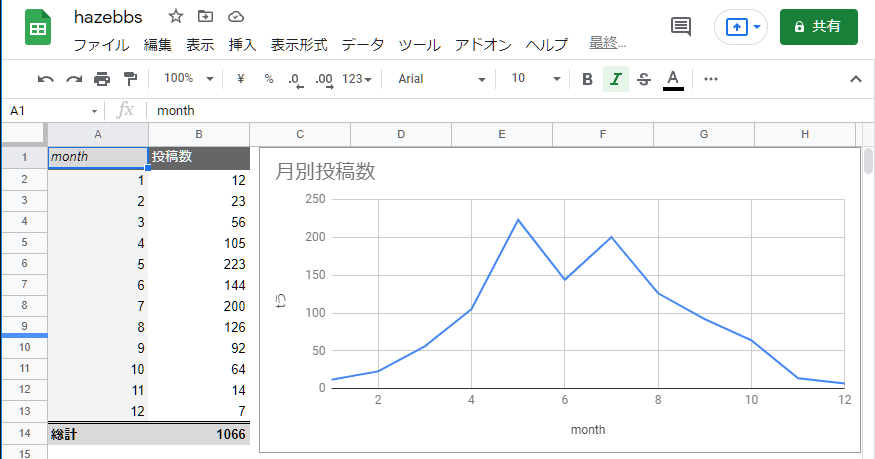
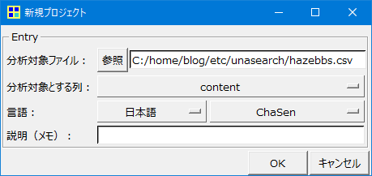
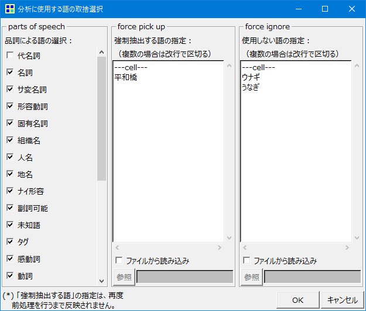
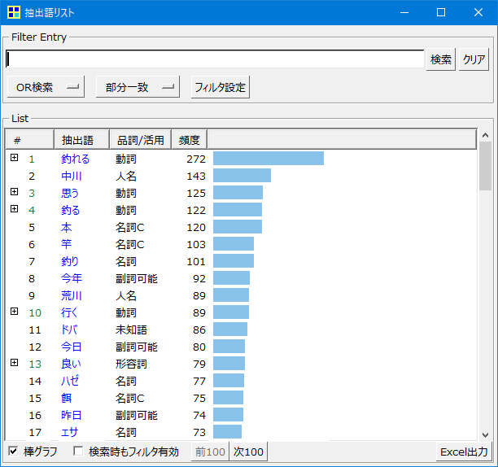
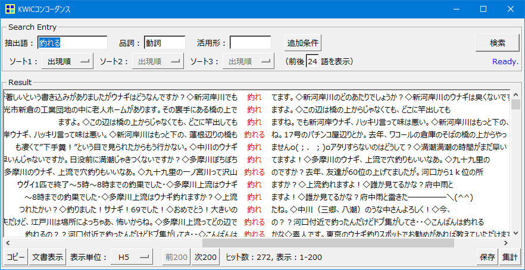
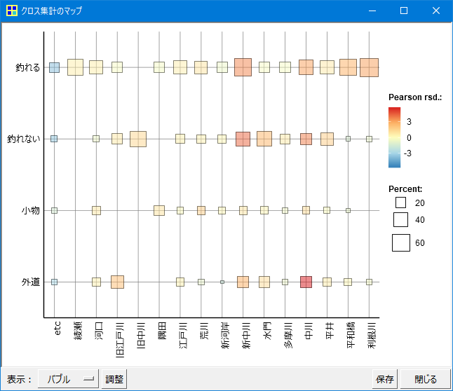
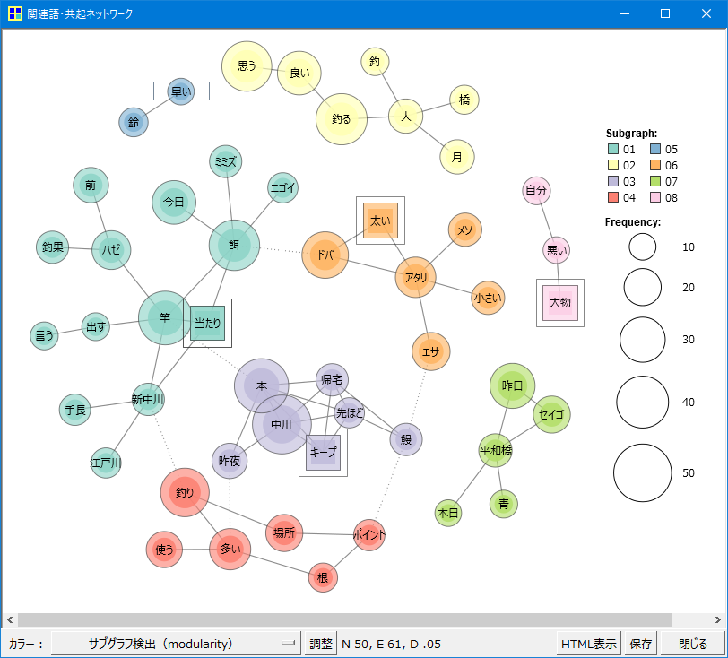

今年からウナギ釣りを始めました。
東京都東側の河川での釣果となりますが、9月に60cm 2匹の良型を掛けることができました。
タックルの準備・釣り方は難しくなく、仕掛けはシンプルで、
投げて待つだけの余りテクニックはいらない釣りの印象がありましたが、
釣れるポイントを探すのはとても大変でした。
東京河川の上流から下流まで広範囲がポイントとなり、大型の河川よりも
どぶ川

釣り掲示板、ブログなどの SNS サイトからウナギ釣りのポイントをリサーチをして、釣行を計画しました。

本記事では東京のウナギ釣り SNS 情報からのポイントを調査をまとめます。

- [東京都の河川のポイント調査](#東京都の河川のポイント調査)
  - [どぶ川雑記帳](#どぶ川雑記帳)
  - [Anglers](#anglers)
  - [関東ウナギ釣り掲示板](#関東ウナギ釣り掲示板)
- [ポイント調査データ](#ポイント調査データ)
- [関東ウナギ釣り掲示板記事分析](#関東ウナギ釣り掲示板記事分析)
  - [事前準備](#事前準備)
  - [抽出語の件数調査](#抽出語の件数調査)
  - [釣れる、釣れないポイントの調査](#釣れる釣れないポイントの調査)
  - [「釣れる」関連語の調査](#釣れる関連語の調査)
- [まとめ](#まとめ)

# 東京都の河川のポイント調査

SNS、ブログ等でウナギ釣りのポイントとして、東京都の河川は釣果実績も多く、広範囲に釣れています。

開削された人口河川が中心、護岸の形状、それぞれの河川に特長があります。

主な河川は以下となります。

* 荒川：新河岸川、隅田川（旧荒川）、荒川放水路
* 利根川：江戸川、旧江戸川
* その間に中川：中川、新中川、旧中川

これら河川の地名は釣果の記事に頻出します。

また、過去の開削の歴史により、河川の名前に新、旧があり、少し紛らわしいと感じましたが、東京の河川の開削についてまとめた以下のブログがとても参考になりました。

## どぶ川雑記帳

６１　中川ウェットランド（前編）

http://dobungawa.blog92.fc2.com/blog-entry-86.html

## Anglers

[Anglers](https://anglers.jp/areas/550/fishes/59)
https://anglers.jp/areas/550/fishes/59

釣果情報SNS
日々更新、東京、ウナギで絞り込み

## 関東ウナギ釣り掲示板

[hazebbs](http://hazebbs.com/bbs3/unagi/)

  関東ウナギ釣り掲示板 記事 4つのURL
 
  * '関東ウナギ釣り': 'http://hazebbs.com/bbs3/unagi/html/log/1211857869.html',
  * '関東ウナギ釣り(その2)': 'http://hazebbs.com/bbs3/unagi/html/log/1279840340.html',
  * '関東ウナギ釣り(その3)': 'http://hazebbs.com/bbs3/test2/mread.cgi/unagi/1408241467/49-98',
  * '東京のウナギ釣り場': 'http://hazebbs.com/bbs3/test/mread.cgi/unagi/1342606169/l50',


# ポイント調査データ

関東ウナギ釣り掲示板
1000件ほどの記事
事前に記事を加工して、CSV に変換するPython スクリプトを実行
記事からポイント（荒川など）のキーワードを抽出しています

東京ウナギ釣りのシーズンについて



時期は6月～9月

# 関東ウナギ釣り掲示板記事分析

## 事前準備

KHCoderに読み込ませて、抽出されたキーワードの分析

KH Coder 起動し、分析対象の CSV ファイルを設定してください。

メニュー : プロジェクト --> 新規を選択し、新規プロジェクト画面から以下を設定します。

* 分析対象ファイル : CSV ファイルを指定
* 分析対象 : content 列



メニュー : 前処理 --> 語の取捨選択を選択し、強制抽出する語に以下を追加します。

```
平和橋
```

使用しない語リストに以下を追加します。

```
ウナギ
うなぎ
```



メニュー : 前処理 --> テキストのチェックを選択します。
問題が発見されるので、テキストの自動修正を実行します。

メニュー : 前処理 --> 前処理 を実行します。

## 抽出語の件数調査

メニュー : ツール --> 抽出語 --> 抽出語リスト を選択します。

「釣れる」が件数ランキング1位で、リンクをクリックします。



「釣れる」の前後の文章リストが表示されます。
文章リストを順に選択し、「文書表示」をクリックして、「釣れる」に関連する記事を調査します。



## 釣れる、釣れないポイントの調査

コーディングルールの作成
クロス集計

メニュー : ツール --> コーディング --> クロス集計 を選択します。

* コーディングルールファイル : [Rule.txt](Rule.txt) を指定します。
* クロス集計 :  point を選択します。

「集計」をクリックして集計を実行した後に、「バブル」をクリックし、バブルチャートを表示します。



## 「釣れる」関連語の調査

メニュー : ツール --> 関連語検索 を選択します。

Search Entry: に「釣れる」をダブルクリックします。共起ネットをクリックし、関連の強い語のネットワーク図を表示します。

共起ネットワーク



# まとめ

第一候補

新中川、平和橋、中川は釣れる傾向が高い

第二候補

旧江戸渡川、江戸川、荒川、新河岸、玉川は同じ傾向

旧中川はつれない
中川は外道も釣れやすい
今は釣れない時期のため、来年調査
実釣記録をまとめる

