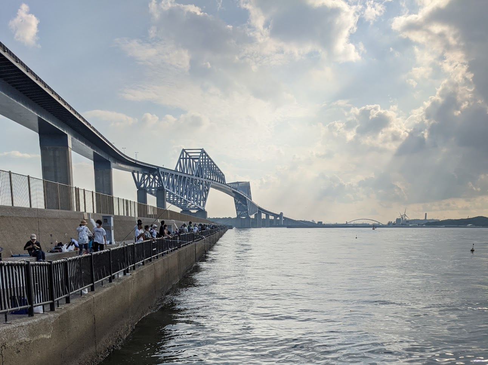
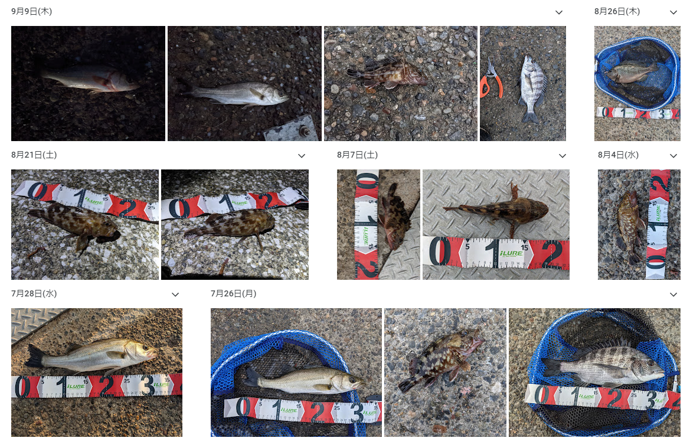
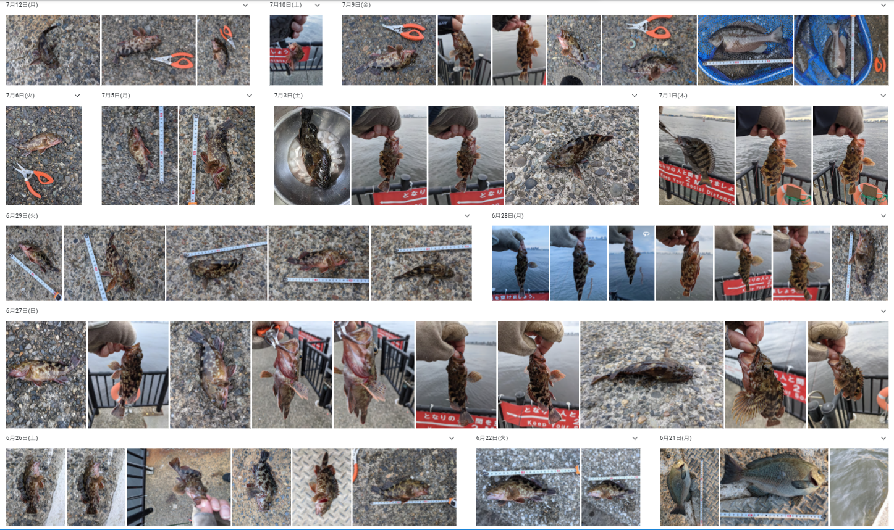
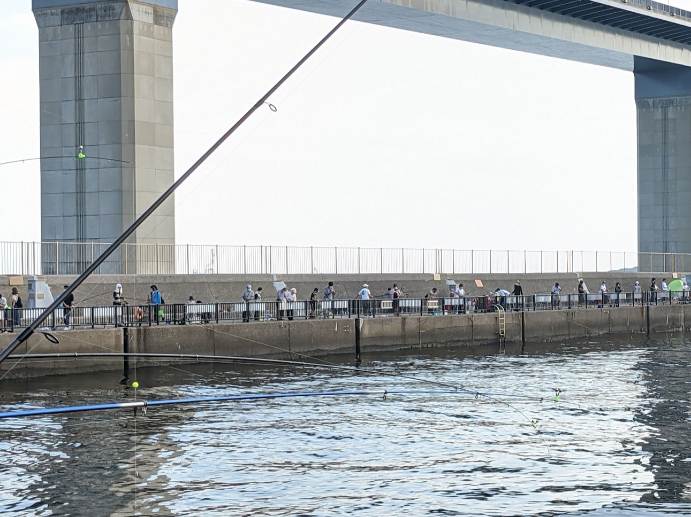
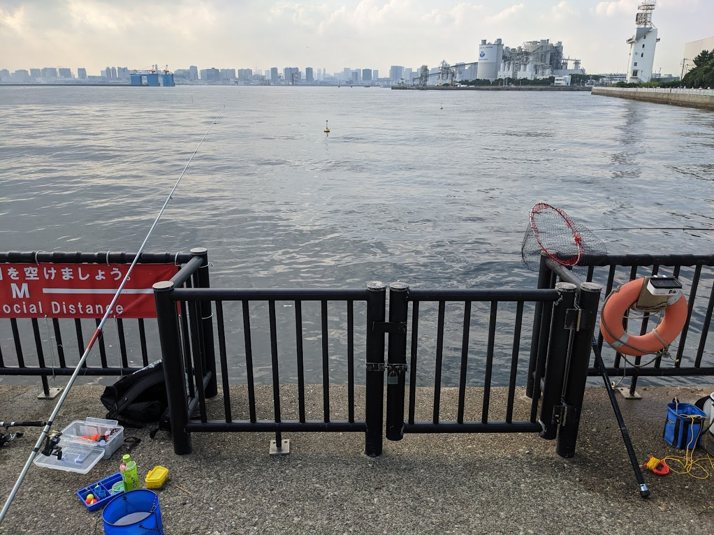
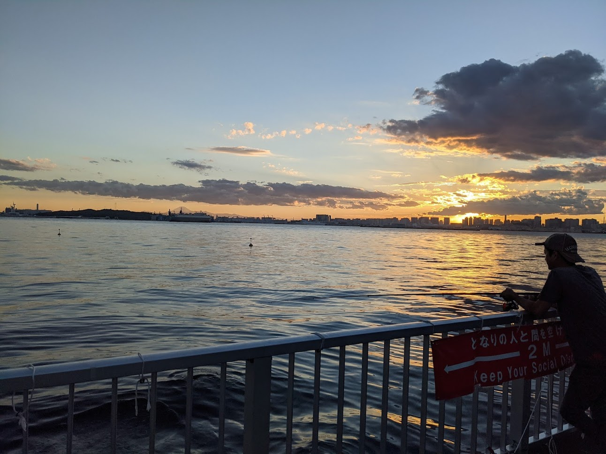
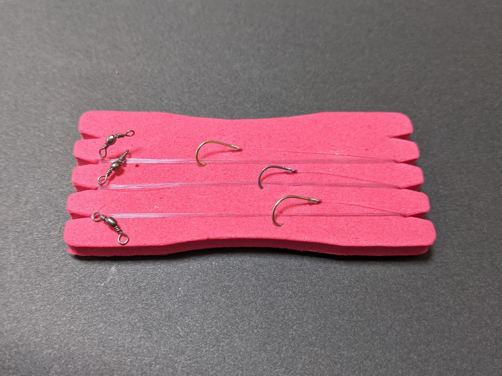
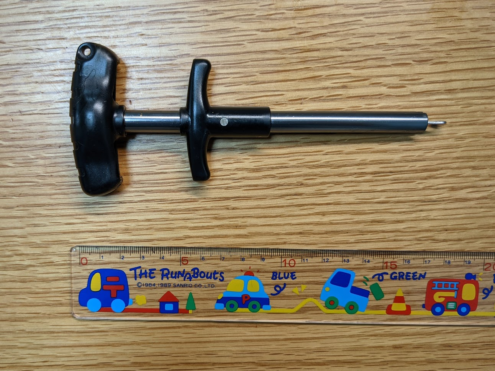

若洲海釣り施設とは、江東区の南側に位置する東京湾奥の海釣り公園です。
東側は荒川河口に面しています。
東京湾奥の複数の川が流れこむ複雑な地形から、川から流れてくる養分によって魚の餌が溜まりやすく、プランクトンや小型の魚も多く、それを狙った大型魚も多いのが特徴です。

都心に近く、潮通しが良いため人気がある釣り場ですが、
休日は人気のためとても混雑し、竿を出すことすら困難になることがあります。

本ブログでは、混雑する釣り場でも釣果を上げられたヘチ釣りについて紹介します。
準備が少なく、後片付けも楽といった手軽な釣り方ですが、
ヘチ釣りで若洲で釣れる殆どの魚種は釣れました。

これから若洲海釣り公園でヘチ釣りをしてみたいという方に、参考にしてみてもらえると幸いです。

ヘチ釣りとは
------------

ヘチ釣りの入門書[「ヘチ・落とし込み釣り入門」、コスミック出版、2018年](www.amazon.co.jp/dp/4774784745)にはこのように書いてあります。

> ヘチ・落とし込み釣りは、針とラインに小さなガン玉だけのシンプルな仕掛けでクロダイを狙うミャク釣りの一つ。
> もとは横浜近郊の低い堤防でクロダイを狙うために生まれた釣り方。
>
> アタリは糸ふけの変化や竿先の微妙な変化を見極めるのがこの釣りの面白さ。

簡単な仕掛けでクロダイなど大型魚を狙う釣りで、初めての方は、[初めての「クロダイ落とし込み釣り」入門、ホンダ釣りクラブ](https://www.honda.co.jp/fishing/enjoy/season/season-201808/step-3/) 
に詳しい説明があるので、こちらを参照してください。

若洲でのヘチ釣りの感想は以下です。

1. 短時間釣行が可能

    混雑している釣り場のため、
    釣り座を確保するために開場前から準備するなど長時間の釣りが必要になりますが、
    ヘチ釣りの場合は、釣り座の確保はせず空いていポイントを探してから直ぐ狙え、釣果も直ぐ出ます。
    空き始める時間帯を狙う必要がありますが、夕方のマヅメの時間帯から約1時間の釣行で十分釣果は出ます。

2. 手軽

   携行品がタモ、ロッド、タックルバックのみで、バイク、自転車釣行が可能でした。
   準備や後片付けも楽で、仕事帰りに回数重ねることができました。

3. 魚とのやり取りが楽しい

   道糸、ハリスにガン玉と針を付けたシンプルな仕掛けのため、
   魚とのやり取りがダイレクトに伝わる釣りになります。
   アタリ、フックのパターンなどから魚がどのように餌を捕食するのかが判りやすく、
   なぜ釣れたのか、ノウハウが蓄積できました。

4. 若洲にいる殆どの魚が釣れる

   カサゴ、メバルなどのロックフィッシュ、クロダイ、メジナなどの大型魚、
   夏から秋にかけてはセイゴクラスが中心ですがシーバスが釣れました。
   特にクロダイは浅ダナのヘチに居ることが多く、良く釣れます。

5. 魚を持ち帰る釣りには向かない

   魚を持ち帰るにはクーラーボックス、スカリが必要になり、機動性が下がります。
   ヘチ釣りとの相性は悪く、リリースを前提とした釣りに適しています。

ヘチ釣りで釣れる魚
----------------

2021年6月のコロナ感染対策で長期間閉鎖されていた堤防が解放されました。
解放されてからの約3か月間で延べ30回ヘチ釣りを試してみた釣果は以下の通りです。
時間帯は平日の夕まづめで日没から1時間での釣果です。
エサはアオイソメを使いました。
主な魚種は以下となります。

1. カサゴ、メバル

    全体の9割はカサゴになり、夜暗くなると、たまにメバルが掛かります。
    何れもアタリは底です。
    長期閉鎖から解放された後は日に10 ～ 20匹と良く釣れましたが、
    今は2 ～ 3匹の釣果となります。
    サイズは10cm ～ 25cmで、20cm 前後が中心です。

2. クロダイ、メジナ、セイゴ（スズキ）

    たまに入口付近の浅ダナでクロダイ、メジナなどの大型魚が釣れました。
    なぜか、浅ダナに居ることが多いようです。
    9月からはスズキが良く釣れるようになりましたが、セイゴクラスが中心です。

3. その他（イシガニ、サバ）

   

   

若洲堤防の特長
-------------

若洲海釣り公園は、防波堤（堤防）、キャンプ側護岸、人口磯の3か所からなります。
いつも利用しているのは堤防で、イワシ、サバなどの回遊魚の魚影が濃く、
足元のサビキ釣りで初心者でも大漁が狙えるとてもも人気があるポイントです。

10m 間隔でケーソン（堤防の基礎）が横一直線に設置されています。
ケーソンの切れ目に間があり、魚の隠れ家になっています。
潮の動きに変化ができるポイントで、エサも豊富で着きやすく、
周辺に仕掛けを落とすのがポイントになります。

ケーソンの4ブロックごとにはしごが設置されており、
はしご付近はイガイなど貝類の付着が多く、こちらもポイントになります。
写真の通りコの字型になっており、竿を出しづらいため、混んでいるときでも空いています。
逆にヘチ釣りには適しており、柵が邪魔にならないので際に落としやすい、
堤防からの距離ができるので、魚から見切られにくくなります。

水深は入口付近で3m、先端で5mとなり、潮の満ち引きによって、前後1.5ｍほど変化します。
足元から1ｍに捨石があり、その先は砂泥が続きます。
堤防の付け根のゴロタ場は根魚の絶好の隠れ家となっています。

釣れる条件
----------

1. 釣れる時間

   夕まずめから堤防が閉場される 夜9時までがお勧めです。
   特に日の入りから1時間にアタリは集中します。
   また、夏休み、休日の昼間など混雑する時期は外した方が良いでしょう。
   場荒れの状態となり、ヘチ釣りの釣果も悪くなります。
   場荒れしてもしばらくすると落ち着くので、
   雨もしくは雨上がりの日、雨の日が続いた後の平日など釣り人が少なくなり
   混雑が落ち着くと、良い釣果となることが多いです。

2. 釣れるポイント

   堤防のケーソンの継ぎ目、はしごの付近となります。
   大型の魚は堤防の先端より手前の浅場の方が釣れやすくなります。

3. 潮流

   干潮時以外がお勧めです。
   浅い水深のため、干潮時は魚に見切られて、アタリは出ずらくなります。
   澄み潮、赤潮など潮の状態はあまり関係なく、風がないなぎの状態でも釣れます。
   風があると仕掛けが流され、アタリが取りずらくなります。

   

装備
-----

1. ロッド

   専門のヘチ竿が適していますが、希少性によるものか専用ロッドは3万円前後と高価で、
   なかなか手が出せません。
   代替策としてメバルロッドを使っています。
   UL,Lの柔らかいロッド、バイトを弾かれにくく、ヘチ釣りに適しています。

   混雑する釣り場なので長いとトラブルが出やすいため、2～3ｍの短めが適しています。
   水面からの高さは2mと低いため、短くても問題ありません。

2. リール

   タイコリールを使用します。ドラグ機能などは不要で、シンプルで安価なもので良いかと思います。

3. 道糸

    視認性の高い落とし込み専用のラインがお勧めです。

4. ハリス、針、サルカン

    ハリスの強度は余り必要なく、フロロカーボンの 1 号前後で良いかと思います。
    きつい根はないので、根掛かりしても後述の回避方法で外せます。
    1.5m位の長さに切って針を付けます。

    針はチヌ針0.5～1.2号を使用し、イソメ餌を通し刺ししています。
    掛かりの良さを優先して、小さめの針を使用しています。
    あまり、大型の魚が釣れたかとがないので判りませんが、
    40cm のクロダイが掛かっても強度的には問題はありませんでした。
    
    下の写真のようにサルカン、ハリス、針を結んだものを、仕掛け巻きに巻いて
    複数セット用意すると、釣り場で直ぐにセットできるため、お勧めです。

   

5. オモリ

    ガン玉Bを、針から 10cm 先に付けています。
    できるだけゆっくり落とした方が良いため、ガン玉B位の軽めのオモリを付けて始めます。
    イソメが自然に落ちる速度をイメージします。
    風、潮流の影響で仕掛けが流される場合は、重めのガン玉を追加して、
    リールに指をあてて、速度をコントロールします。

5. エサ箱

    夏場はエサがすぐ弱ってしまうので、保冷剤が装着できる少し大きめのエサ箱がお勧めです。

6. ヘッドライト

    堤防に常夜灯がありますが最小限の灯のため、ヘッドライトは必須です。

7. タモ、玉網

    たまに掛かる大型にはタモが必要ですが、30 cm 位までならぶっこ抜きでも大丈夫です。
    カサゴなどロックフィッシュは基本的に不要です。

8. 針はずし

   なくても良い装備ですが、下の写真の針はずしがあると魚をリリースするまでの効率が
   格段に良くなります。マズメ時は集中して釣れ、針を飲まれた場合でも直ぐ外せるため、
   とても重宝しています。

   

釣り方
---------

1. ケーソン継ぎ目、梯子が掛かっているコの字型の柵に落とします。

   30cm 以内の際に仕掛けを落とします。
   その時に海面をのぞき込むことはしません。
   浅ダナの釣りのため人影を海面に出さすと見切られます。
   また、糸ふけはとって、糸が張った状態で落とした方が良いです。
   糸ふけががあるとアタリの出方もアワセも遅れる可能性が高くなります。

2. 一旦底まで落とします

   自然にイソメが落ちるスピードをイメージしてゆっくり落とします。
   着底したら底立ちさせます。
   仕掛けが底に着かない様にすれすれの状態にして、30秒くらい待ちます。
   落とし込んでいく途中で何か違和感やいつもと違う感じがしたら瞬時にスナップを
   利かせて軽くアワセを入れます。
   アタリは不自然なラインの動き、ロッドの先端の動き、手の感触で確認します。
   アタリがでたらそっと竿を上げてフッキングさせます。

   アタリがなければまたその付近に落とします。
   2，3回繰り返し、それでもアタリがなければ次のポイントに移動します。

3. 魚が掛かったら

   根に入られないように誘導します。
   竿先を上げてできるだけ堤防から離れるよう竿先でコントロールします。
   クロダイ、メジナなどの大型が掛かったらタモを使います。
   カサゴはぶっこ抜きで良いでしょう。

トラブルの対処
--------------

### 根掛かりした場合

掛かった後に、根に入られて根掛かりすることがあります。
強引に引っ張ると根掛かりが悪化して、回収は困難になります。
まず、そっと左右にずらして根掛かりが起きている位置など様子をみます。
一旦ラインを1mたるませて、数十秒ほど放置します。
その後、リールでラインをゆっくり巻きます。
その際は、探りを入れるように感触を見ながらそっと巻きます。
上手く外れなかったら、またラインをたるませて繰り返し鱒。

まとめ
------
