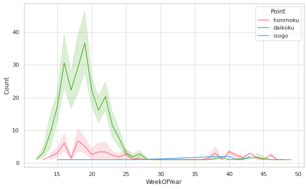
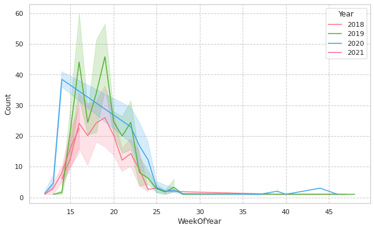
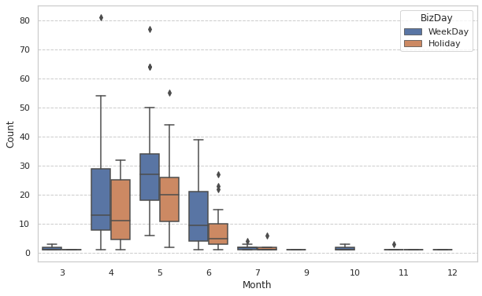
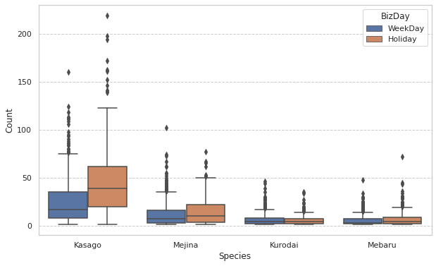
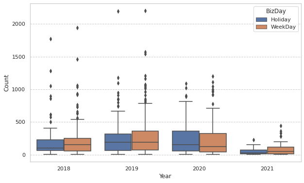
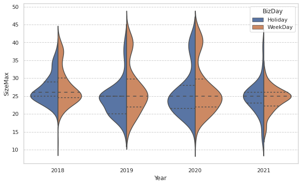
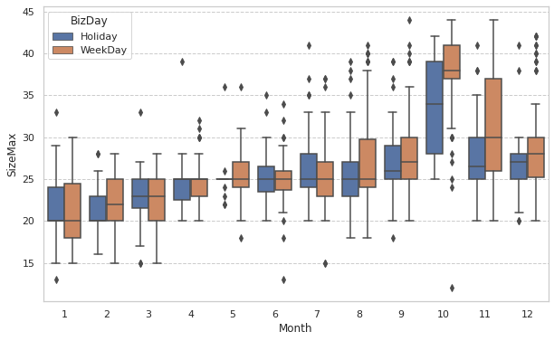
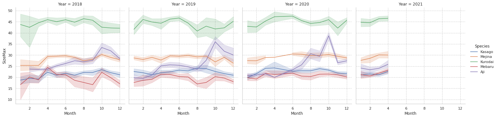

# 海釣り施設について

# fishing-piers-fan

# 釣果分析例

## シリヤケイカ

大黒海釣り施設の釣果が良い

第15週 : 4/16
第20週 : 5/20
第25週 : 6/24

大黒海釣り施設に絞って、年度ごとの釣果を比較
2019年の釣果が良い、今年は、2018年と同じ傾向

大黒海釣り施設の平日、休日の釣果
平日の方が釣果が良い

## 平日と休日の釣果の比較

大黒海釣り施設に限定。カサゴ、メジナ、クロダイ、
メバルに限定。落とし込み、足元で釣る魚種は休日の方が釣果が良い

アジは平日の方が釣果が良い

アジの釣果サイズ最大値[cm]
40cm前後の大型サイズは休日の方が多い

月ごとの比較、最盛期の10-11月が特に良い
大型のアジを狙うなら、平日の10-11月が良い

休日、平日により釣果が変わる魚種と、変わらない魚種がある
入場者数などの混雑度が影響している
アジなどの回遊系の魚種は平日の方が良い
ロックフィッシュ、クロダイなど落とし込みで釣る魚はあまり変わらない

## 魚種によって年々釣果サイズが上がっている

カサゴ、メバルなど、成長の遅い魚
15cm以下の魚種はリリースするルール
資源保護のモラル、マナーが醸成された結果

# まとめ
