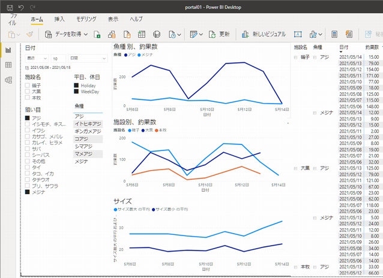
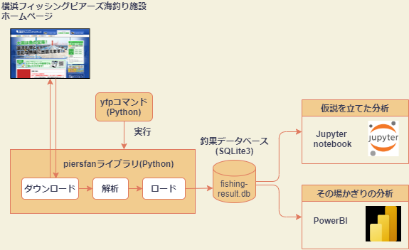

- [前回の釣果分析の課題](#前回の釣果分析の課題)
- [システム概要](#システム概要)
  - [PowerBI とは](#powerbi-とは)
- [セットアップ手順](#セットアップ手順)
  - [釣果収集ライブラリセットアップ](#釣果収集ライブラリセットアップ)
  - [PowerBIセットアップ](#powerbiセットアップ)
- [利用手順](#利用手順)
  - [釣果収集](#釣果収集)
  - [PowerBI レポート分析](#powerbi-レポート分析)
    - [狙い目のマスターデータメンテナンス](#狙い目のマスターデータメンテナンス)
  - [まとめ](#まとめ)

# 前回の釣果分析の課題

この記事は、横浜フィッシングピアーズ海釣り施設、釣果分析の続きです。
前回、横浜フィッシングピアーズ海釣り施設の釣行計画のための釣果分析を紹介しました。
分析ツールに Python の統計ライブラリを使用し、仮説を立てて分析して検証する方法をとりました。
今後、分析レポートを整備していく予定でしたが、作業にあたり色々と不都合を感じることがありました。
Excelの様に直観的に操作でき、より手軽なツールの方が良いのではないかと検討をすすめ、今回、釣果分析プロジェクト 「fising-piers-fan」 にMicrosoft社製の PowerBI を導入しました。
本ツールの利用手順についてまとめます。

# システム概要

システム全体の構成は以下の通りです。



* yfp コマンド
  * Python のコマンドラインツールで、Python ライブラリやデータベースを管理します。
  * 本コマンドを実行して、釣果情報の収集、データベースの登録をします。
* piersfan ライブラリ
  * Python 製ライブラリで、各海釣り施設のホームページから、釣果情報を収集してデータベースに登録します。
* 釣果データベース
  * SQLite3 データベースで、釣果記事の魚種別釣果、コメントデータを蓄積します。
* 分析ツール
  * 仮説を立てた分析
    * Python 製 Jupyter notebook の Web コンソールを用いて分析レポートを作成します。
    * Python 言語を用いて、分析レポートをコーディングします。
  * その場かぎりの分析
    * Microsoft 社製 BI ツール PowerBI を用います。
    * 殆どの操作は GUI で、Excel のような操作で分析を行います。

今回、分析ツールは上記2本立てにしました。
一つ目は、前回の記事でまとめた、何時、何処でどのような条件で釣果が良いのかを仮説を立てて分析するアプローチになります。Python 言語で分析レポートをコーディングし、長期間のデータから分析、検証をする手法となります。
二つ目は、次の釣行計画の準備などで用いる短期的な釣果分析で、とりあえず次の釣行を計画したいときなど、手軽に分析を行うアプローチになります。

## PowerBI とは

今回、導入した PowerBI ですが以下に説明があります。

引用：[「Excelから簡単に分析できるPowerBI超入門」](https://swri.jp/article/589)

> PowerBIは、マイクロソフトが力を入れているプログラムで、「対話型のデータ可視化BIツール」だ。簡単に言ってしまうと売上や在庫などのデータから、さまざまな形で情報を取りだしてグラフ等による可視化ができるものだ。「PowerBI Desktop」なら、だれでも無料で利用可能だ。

殆どの操作はGUIなので、手軽に使え、戸惑うことなく分析に集中できます。
ただし、機能は豊富なため、事前に基本的な操作を習得しておかないと利用に戸惑うことがあるかと思います。
基本操作の習得には以下のリファレンスサイトがお勧めで、チュートリアル形式で習得できます。

* [PowerBI自習書](http://www.sqlquality.com/Self2016/PowerBIver2/Text/Step01-01.html)


* [Online Book: Power BI From Rookie to Rockstar - RADACAD](https://radacad.com/online-book-power-bi-from-rookie-to-rockstar)

２つめは英語となりますが、とても良くまとまっている優良サイトです。ページ数が豊富なので全て読むのは大変ですが、その中で第一部の章を読めば、主要な操作は習得できます。

# セットアップ手順

Windows 10 64ビット版環境でのツールセットアップ手順を記します。

事前に、Python 3.9 の環境が必要です。以下のリファレンスを参考にしてPythonインストールしてください。

[Windows版Pythonのインストール](https://www.python.jp/install/windows/install.html)

## 釣果収集ライブラリセットアップ

以下のGitHub URLから、釣果分析プロジェクトfishing-piers-fanをダウンロードします。

```
https://github.com/mon3nr/fishing-piers-fan
```

ダウンロードファイル fishing-piers-fan-main.zip を任意のディレクトリに解凍します。ここでは、c:\home の下に解凍します。解凍したディレクトリに移動し、[Readme.md](https://github.com/mon3nr/fishing-piers-fan/Readme.md) のインストールに記した手順で Python ライブラリをインストールします。

```
cd c:\home\fishing-piers-fan-main
python -m pip install -e .
```

インストールが終わったら、yfp -h で yfp コマンドヘルプが正しく実行できるか確認してください。

```
yfp -h
```

## PowerBIセットアップ

[PowerBIセットアップ](https://github.com/mon3nr/fishing-piers-fan/blob/main/docs/setup_powerbi.md)に記した手順で PowerBI をインストールします。
データベースの接続設定について、詳細設定オプションの接続文字列は以下の記述で、「インストールディレクトリ/data/fishing_result.db」 で、データベースのパスを指定してください。

インストール先がC:\home\fishing-piers-fan-mainの場合は以下のような記述になります。

```
database=C:\home\fishing-piers-fan-main\data\fishing_result.db
```

# 利用手順

## 釣果収集

yfpコマンドの実行

当月の50ページ分の釣果情報を収集して、データベースに登録します。

```
yfp -p 50
```

実行結果は以下となります。

```
2021/05/15 19:09:59 [INFO] downloader initialize C:\home\fishing-piers-fan-main\data\download
2021/05/15 19:09:59 [INFO] downloader post a search request for daikoku in 2021/5
2021/05/15 19:10:03 [INFO] downloader save choka_daikoku_2021_05_001.html
2021/05/15 19:10:07 [INFO] downloader save choka_daikoku_2021_05_002.html

<中略>

2021/05/15 20:02:47 [INFO] datastore initial load : {'choka.csv': 709, 'comment.csv': 43, 'newsline.csv': 211}
```

jupyter-notebook を開く

## PowerBI レポート分析

アジの釣果分析

土日は行かないので、WeekDay のみにチェック

最近4日間

狙い目の魚種を選択、アジなど

### 狙い目のマスターデータメンテナンス

## まとめ

